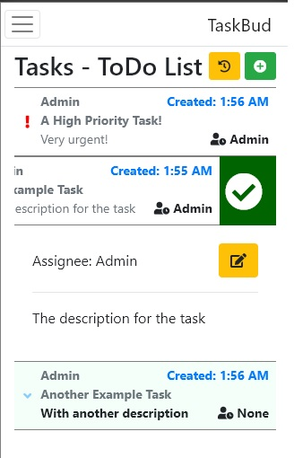
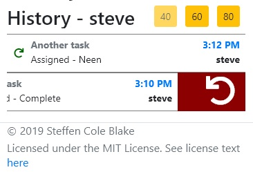

# TaskBud
Simple and  Lightweight Task Organizer/Manager Web Server, written in Asp.Net MVC Core

 

# Links
* [Setup Guide](https://github.com/SteffenBlake/TaskBud/wiki/Setup-Guide)
* [Usage Guide](https://github.com/SteffenBlake/TaskBud/wiki/Usage-Guide)

# Features and Functionality

* Supports Markdown in Task Descriptions
* Mobile first design, just swipe to mark tasks as done and to claim them!
* Minimalist, slick interface
* Invitation Code based Registration, with simple copy and paste invitation links
* Currently supported Databases: PostgreSQL, MSSQL (More to come hopefully!)
* Easy configuration via AppSettings.json / command line args
* Open Source, free to use!
* Built with .NET Core, which means full cross platform support, host it on whatever you please!
* Web Server means everything is served over browsers, so its platform agnostic!
* Designed utilizing SignalR for Real-Time app updates, no need to refresh the page, tasks auto-pop up when updated/created, and auto-dissapear when claimed/completed by any user!
* Simple History interface to give basic "Undo" and "Redo" functionality

Work in progress before first release!

# ToDo List
- [ ] Make Invitation Code screen more mobile friendly
- [ ] Enforce Administrator password change, or at the very least bug you about it
- [x] History+Undo Functionality
- [ ] Support more database types
- [ ] Add support for opt-in 2FA, with configurable email server bits
- [ ] Add support for Azure Web Service hosting with Azure Key Vault Storage
- [ ] Maybe add support for attaching images to issues? If people really want that.
- [ ] Add support for push notifications while open, opt in(?)
- [ ] Add configuration and support for SSL Signing / HTTPS
- [x] Add a "Wait until" property to Tasks
- [x] Add a "Automatic Repeat" functionality to Tasks
- [x] Expose usable API for IoT stuff / IFTTT / Home Assistants
- [ ] Setup wiki and document better
- [ ] Make some "how to use" youtube videos
...
- [x] Acknowledge the irony of a To-Do list on the README for your To-Do list app...
